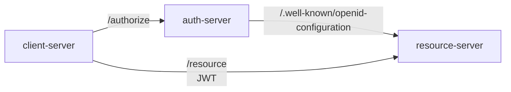
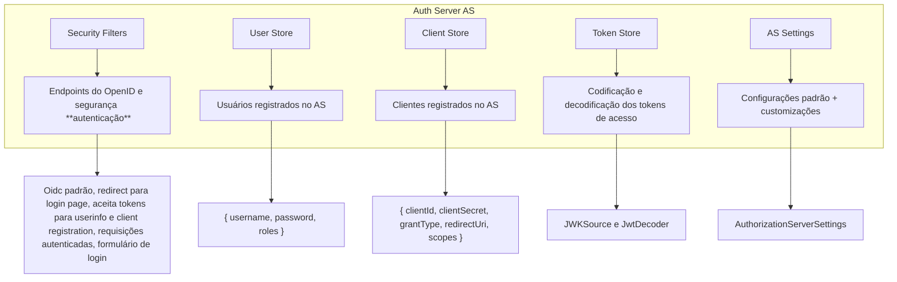
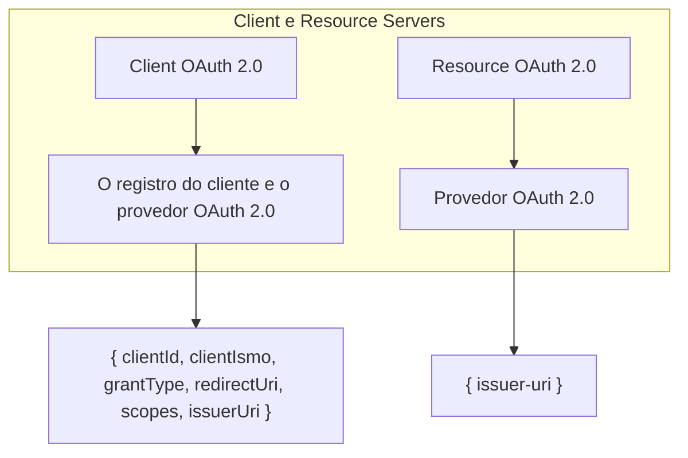

# Spring AS

Este projeto implementa um servidor de autorização usando o framework Spring Security para OAuth 2.0 e OpenID Connect. O servidor de autorização (Authorization Server) gerencia autenticação, armazenamento de clientes e usuários, e geração de tokens para proteger as APIs de recursos (Resource Server).

## Arquitetura do projeto

- `client-server`: Requisições de autorização e acesso aos recursos são enviadas pelo cliente.
- `auth-server`: Responsável pela autenticação e autorização do cliente.
- `resource-server`: Fornece acesso aos recursos protegidos após a validação dos tokens.

## Detalhes do Authorization Server

### Componentes
- `Security Filters`: Gerencia endpoints do OpenID e configurações de segurança para autenticação.
- `User Store`: Armazena as credenciais e roles dos usuários.
- `Client Store`: Registra clientes autorizados, incluindo clientId, clientSecret, grantType, redirectUri, scopes.
- `Token Store`: Codifica e decodifica tokens de acesso para autenticação.
- `AS Settings`: Configurações padrão e customizações para o servidor de autorização.

### Fluxo de Dados
- `Security Filters` usa o OpenID Connect padrão, redireciona para a página de login e lida com tokens para userinfo e client registration.
- `User Store` e `Client Store` registram dados como credenciais, roles e informações do cliente.
- `Token Store` trabalha com fontes JWT e decodificadores JWT para manter tokens seguros e utilizáveis.
- `AS Settings` permite configurações adicionais para adaptar o servidor de autorização a diferentes cenários de segurança.

## Cliente OAuth e Resource Servers

### Componentes 
- `Client OAuth 2.0`: O cliente que realiza o registro e autenticação com o provedor OAuth 2.0.
- `Resource OAuth 2.0`: O servidor de recursos que utiliza OAuth 2.0 para validação de acesso aos recursos.
- `Provedor OAuth 2.0`´: O servidor de autorização que gerencia os registros e emite tokens para o cliente, especificando issuer-uri e outros parâmetros.

### Fluxo de Registro
- `Client OAuth 2.0` registra-se com o Authorization Server, fornecendo informações como clientId, clientSecret, grantType, redirectUri, e scopes.
- `Resource OAuth 2.0` valida as requisições do cliente usando tokens emitidos pelo Authorization Server.

 