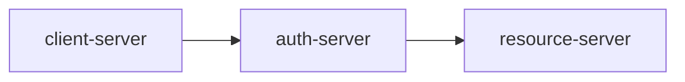
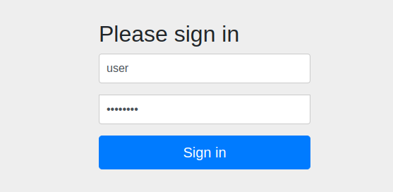
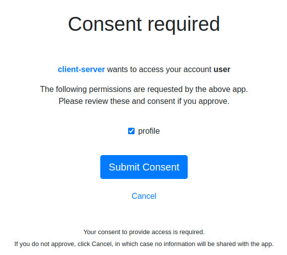
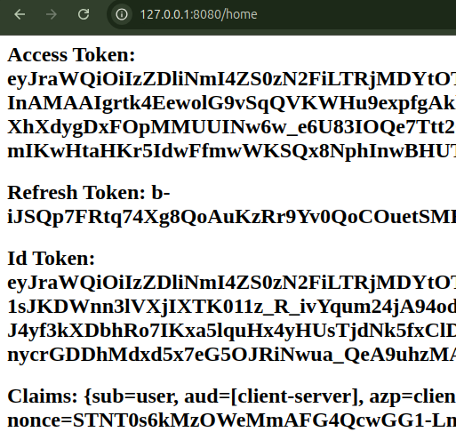
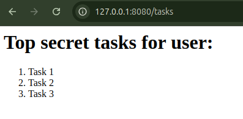
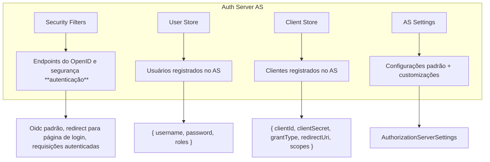

# Spring AS 🌿

Este projeto implementa um servidor de autorização usando o framework Spring Security para OAuth 2.0 e OpenID Connect. O servidor de autorização (Authorization Server) gerencia autenticação, armazenamento de clientes e usuários, e geração de tokens para proteger as APIs de recursos (Resource Server).

## Arquitetura do projeto 📚

- `client-server`: Requisições de autorização e acesso aos recursos são enviadas pelo cliente.
- `auth-server`: Responsável pela autenticação e autorização do cliente.
- `resource-server`: Fornece acesso aos recursos protegidos após a validação dos tokens.

## Manual 📖
1. Acessar `127.0.0.1:8080/home`

2. Efetuar login com as seguintes credenciais:
    - `Username`: "user"
    - `Password`: "password"

    
3. Aceitar o uso do Scope "profile":

    

    Pronto! 🚀  O usuário está autenticado! Esse endpoint de redirecionamento contém  algumas informações do fluxo OAuth: 
    - **Access Token**: Usado para acessar recursos protegidos no servidor. 
    - **Refresh Token**: Usado para obter um novo Access Token quando o atual expira, permitindo estender a sessão sem novo login.  
    - **ID Token**: Contém informações sobre o usuário autenticado (como nome e e-mail) e é usado para identificar o usuário. Lembrete: Somente o access token autentica usuário!
    - **Claims**: Informações que representam dados do usuário.
    
    

4. ✨ Acessar o recurso protegido: `127.0.0.1:8080/tasks`

    

    Note que ao tentar acessar o recurso protegido (resource server) diretamente em `127.0.0.1:9090/tasks` não será possível. É necessário primeiro se autenticar pelo Authorization Server para obter acesso.

## Detalhes do `Authorization Server` 📕

### Componentes
- `Security Filters`: Gerencia endpoints do OpenID e configurações de segurança para autenticação.
- `User Store`: Armazena as credenciais e roles dos usuários.
- `Client Store`: Registra clientes autorizados, incluindo clientId, clientSecret, grantType, redirectUri, scopes. 
- `AS Settings`: Configurações padrão e customizações para o servidor de autorização.

### Fluxo de Dados
- `Security Filters` usa o OpenID Connect padrão, redireciona para a página de login e lida com tokens para userinfo e client registration.
- `User Store` e `Client Store` registram dados como credenciais, roles e informações do cliente. 
- `AS Settings` permite configurações adicionais para adaptar o servidor de autorização a diferentes cenários de segurança.

## Detalhes do `Client` e `Resource Server` 📘  
 
### Fluxo de Registro
- `Client OAuth 2.0` registra-se com o Authorization Server, fornecendo informações como clientId, clientSecret, grantType, redirectUri, e scopes.
- `Resource OAuth 2.0` valida as requisições do cliente usando tokens emitidos pelo Authorization Server.
 
